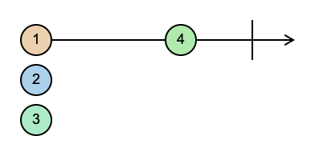

## Pull vs Push systems

Pull - In Pull systems, the Consumer determines when it receives data from the data Producer. The Producer itself is unaware of when the data will be delivered to the Consumer.

Every JavaScript Function is a Pull system. The function is a Producer of data, and the code that calls the function is consuming it by "pulling" out a single return value from its call.

*Signle value Pull*
```javascript
function foo() {
  return 'Hello world!';
}

const result = foo();
```

*Multi value Pull*
```javascript 
function* foo() {
  let i = 0;
  while (true) {
    yield `Hello world! ${i++}`;
  }
}
const it = foo();
console.log(it.next()); // > "Hello world! 0"
console.log(it.next()); // > "Hello world! 1"
console.log(it.next()); // > "Hello world! 2"
```

Push - In Push systems, the Producer determines when to send data to the Consumer. The Consumer is unaware of when it will receive that data.

Promises are the most common type of Push system in JavaScript today. A Promise (the Producer) delivers a resolved value to registered callbacks (the Consumers), but unlike functions, it is the Promise which is in charge of determining precisely when that value is "pushed" to the callbacks.

RxJS introduces Observables, a new Push system for JavaScript. An Observable is a Producer of multiple values, "pushing" them to Observers (Consumers).

* A Function is a lazily evaluated computation that synchronously returns a single value on invocation.
* A generator is a lazily evaluated computation that synchronously returns zero to (potentially) infinite values on iteration.
* A Promise is a computation that may (or may not) eventually return a single value.
* An Observable is a lazily evaluated computation that can synchronously or asynchronously return zero to (potentially) infinite values from the time it's invoked onwards.

## Reactive Extensions for JavaScript

RxJS is a library for composing asynchronous and event-based programs by using observable sequences. It provides one core type, the Observable, satellite types (Observer, Schedulers, Subjects) and operators inspired by Array methods (map, filter, reduce, every, etc) to allow handling asynchronous events as collections.

Think of RxJS as Lodash for events.

ReactiveX combines the Observer pattern with the Iterator pattern and functional programming with collections to fill the need for an ideal way of managing sequences of events.

The essential concepts in RxJS which solve async event management are:

* Observable: represents the idea of an invokable collection of future values or events.
* Observer: is a collection of callbacks that knows how to listen to values delivered by the Observable.
* Subscription: represents the execution of an Observable, is primarily useful for cancelling the execution.
* Operators: are pure functions that enable a functional programming style of dealing with collections with operations like map, filter, concat, reduce, etc.
* Subject: is equivalent to an EventEmitter, and the only way of multicasting a value or event to multiple Observers.
* Schedulers: are centralized dispatchers to control concurrency, allowing us to coordinate when computation happens on e.g. setTimeout or requestAnimationFrame or others.

```javascript
import { Observable } from 'rxjs';

const observable = new Observable((observer) => {
  observer.next(1);
  observer.next(2);
  observer.next(3);
  setTimeout(() => {
    observer.next(4);
    observer.complete();
  }, 1000);
});

console.log('just before subscribe'); // Logs first

const observer = {
  next(x) {
    console.log('got value ' + x); // Logs third (1), forth (2), fifth (3), sixt (4)
  },
  error(err) {
    console.error('something wrong occurred: ' + err); // Never logs in this case (we can enter his handler with observer.error(...))
  },
  complete() {
    console.log('done'); // Logs seventh
  },
};

const subscription = observable.subscribe(observer);

// subscription allows us to unsubscribe at anytime we want using the unsubscribe method.

console.log('just after subscribe'); // Logs second
```

## Marble diagrams

To explain how operators work, textual descriptions are often not enough. Many operators are related to time, they may for instance delay, sample, throttle, or debounce value emissions in different ways. Diagrams are often a better tool for that. Marble Diagrams are visual representations of how operators work, and include the input Observable(s), the operator and its parameters, and the output Observable.

<div style="background: #FFFFFF; color: #000">
  
</div>
</br>
How would the previous example that we saw would look:



[Check out this cool marble generator](https://swirly.dev/)

===

## Exercise 1:

Using `setInterval` create a observable factory function that emits whole numbers (0, 1, 2, 3 ...) by given delay until we unsubscribe.

```javascript
const stream$ = interval(1000); // this will emit values every 1000 ms

const subscription = stream$.subscribe({
  next: (value: number) => console.log(value), // this should log 0, 1, 2 because we will unsubsctibe after 3 seconds
  complete: () => console.log('Finish')
});

setTimeout(() => {
  subscription.unsubscribe();
}, 3000);
```

===

## RxJS Operators

RxJS is mostly useful for its operators, even though the Observable is the foundation. Operators are the essential pieces that allow complex asynchronous code to be easily composed in a declarative manner.

**Creation Operators** are the kind of operator, which can be called as standalone functions to create a new Observable. For example: of(1, 2, 3) creates an observable that will emit 1, 2, and 3, one right after another. Creation operators will be discussed in more detail in a later section.

```javascript
import { of, map } from 'rxjs';

of(1, 2, 3) // creation operator
  .subscribe((v) => console.log(`value: ${v}`));

// Logs:
// value: 4
```

**Pipeable Operators** are operators that can be piped to Observables using the syntax observableInstance.pipe(operator()). These include, filter(...), and mergeMap(...). When called, they do not change the existing Observable instance. Instead, they return a new Observable, whose subscription logic is based on the first Observable.

*A Pipeable Operator is a function that takes an Observable as its input and returns another Observable. It is a pure operation: the previous Observable stays unmodified.*


The map operator
```javascript
import { of, map } from 'rxjs';

of(1, 2, 3) // creation operator
  .pipe(
    map((x) => x * x), // pipable operator
    filter(x => x % 2 === 0)
  )
  .subscribe((v) => console.log(`value: ${v}`));

// Logs:
// value: 4
```

The mergeMap operator
```javascript

import { of, mergeMap, interval, take } from 'rxjs';

of(1,2,3).pipe(
  mergeMap(x => 
    interval(x * 1000).pipe(take(x))
  ) 
).subscribe(console.log);

// The output will be 
// > 0 
// > 0 
// > 0 
// > 1
// > 1
// > 2

```

## Exercise 2:

Using `fromFetch` that is a wrapper over the browser `fetch` and using `map` and `mergeMap` solve the following task: lets have an observable that is sending us the paths `/users`, `/posts` and `/commnets` (`of('/users', '/posts', '/comments')`) and we want get the returned values for this given paths from `https://jsonplaceholder.typicode.com/`. Construct the correct path, then using `fromFetch(url)` create an observable that will fetch the data and merge it into the current stream. Keep in mind that fetch returns a `response` object that we will also need to handle by calling `response.json()` which is ansyc and returns a promise so we will have to merge this as well into our stream.

## **HOT** vs **COLD** observables

There are two types of observables: **hot** and **cold**. 

The main difference is that a **cold observable creates a data producer for each subscriber**, whereas a **hot observable creates a data producer first, and each subscriber gets the data from one producer, starting from the moment of subscription**.

## Exercise 3:

Using `addEventListener` lets create our first **HOT** observable factory called `fromEvent`. The function will accept as first argument an HTMLElement and as a second a DOM Event that we want to listen to. The function should return an observable with every event of that type.

Example:
```javascript
const btn = document.getElementById('#my-button');

fromEvent(btn, 'click').subscribe(console.log); // should print the click event object every time the button is clicked
```

## Exercise 4:
Using `fromEvent` create 3 buttons - `Get users`, `Get posts` and `Get comments` and connect those to `Exercise 2`


## Combine / Join / Merge observables

Sometimes we need to somehow combine, merge, join different streams in order to produce the results that we need. This is where this operatos come into play:

* [combineLatest](https://rxjs.dev/api/index/function/combineLatest) -
Combines multiple Observables to create an Observable whose values are calculated from the latest values of each of its input Observables.


* [concat](https://rxjs.dev/api/index/function/concat) -
Creates an output Observable which sequentially emits all values from given Observable and then moves on to the next.


* [forkJoin](https://rxjs.dev/api/index/function/forkJoin) -
Wait for Observables to complete and then combine last values they emitted; complete immediately if an empty array is passed.


* [merge](https://rxjs.dev/api/index/function/merge) -
Creates an output Observable which concurrently emits all values from every given input Observable.


* [partition](https://rxjs.dev/api/index/function/partition) -
Splits the source Observable into two, one with values that satisfy a predicate, and another with values that don't satisfy the predicate.


* [race](https://rxjs.dev/api/index/function/race) -
First observable that emits wins


* [zip](https://rxjs.dev/api/index/function/zip) -


## Higher-order Observables

The `concatAll()` operator subscribes to each "inner" Observable that comes out of the "outer" Observable, and copies all the emitted values until that Observable completes, and goes on to the next one. All of the values are in that way concatenated. Other useful flattening operators (called join operators) are

* mergeAll() — subscribes to each inner Observable as it arrives, then emits each value as it arrives

* switchAll() — subscribes to the first inner Observable when it arrives, and emits each value as it arrives, but when the next inner Observable arrives, unsubscribes to the previous one, and subscribes to the new one.

* exhaustAll() — subscribes to the first inner Observable when it arrives, and emits each value as it arrives, discarding all newly arriving inner Observables until that first one completes, then waits for the next inner Observable.

Just as many array libraries combine map() and flat() (or flatten()) into a single flatMap(), there are mapping equivalents of all the RxJS flattening operators concatMap(), mergeMap(), switchMap(), and exhaustMap().

---

### Example

```javascript
const api = 'https://jsonplaceholder.typicode.com/';

of('users', 'posts', 'comments')
  .pipe(
    map((x) => fromFetch((api + x))),
    concatAll(), // concat every stream into the current one
    map(res => res.json()), // return a new stream
    zipAll(), // wait for the streams to complete and zip them into an array
  )
  .subscribe({
    next: (v) => console.log(v), // here we should log an array of the users array, posts array and comments array
    error: (e) => console.error(e),
    complete: () => console.log('Completed!')
  })
```

---


## Creating custom operators

using `pipe` function for chaining existing operators
```javascript
import { pipe, filter, map } from 'rxjs';

function discardOddDoubleEven() {
  return pipe(
    filter((v) => !(v % 2)),
    map((v) => v + v)
  );
}
```

without `pipe` function for more complex cases

```javascript
function tap<T>(fn: (value: T) => void) {
  return (observable: Observable<T>) => {
    return new Observable(observer => {
      observable.subscribe({
        next: (value) => {
          fn(value);
          observer.next(value);
        },
        error: (error) => observer.error(error),
        complete: () => observer.complete()
      });
    });
  };
}

of(1, 2, 3).pipe(tapp(console.log)).subscribe();
```

## Subjects
What is a Subject? An RxJS Subject is a special type of Observable that allows values to be multicasted to many Observers. While plain Observables are unicast (each subscribed Observer owns an independent execution of the Observable), Subjects are multicast.

Every Subject is an Observable. Given a Subject, you can subscribe to it, providing an Observer, which will start receiving values normally. From the perspective of the Observer, it cannot tell whether the Observable execution is coming from a plain unicast Observable or a Subject.

Internally to the Subject, subscribe does not invoke a new execution that delivers values. It simply registers the given Observer in a list of Observers, similarly to how addListener usually works in other libraries and languages.

Every Subject is an Observer. It is an object with the methods next(v), error(e), and complete(). To feed a new value to the Subject, just call next(theValue), and it will be multicasted to the Observers registered to listen to the Subject.

```javascript
import { Subject } from 'rxjs';
 
const subject = new Subject<number>();
 
subject.subscribe({
  next: (v) => console.log(`observerA: ${v}`),
});
subject.subscribe({
  next: (v) => console.log(`observerB: ${v}`),
});
 
subject.next(1);
subject.next(2);
 
// Logs:
// observerA: 1
// observerB: 1
// observerA: 2
// observerB: 2
```

Since a Subject is an Observer, this also means you may provide a Subject as the argument to the subscribe of any Observable, like the example below shows:

```javascript
import { Subject, from } from 'rxjs';
 
const subject = new Subject<number>();
 
subject.subscribe({
  next: (v) => console.log(`observerA: ${v}`),
});
subject.subscribe({
  next: (v) => console.log(`observerB: ${v}`),
});
 
const observable = from([1, 2, 3]);
 
observable.subscribe(subject); // You can subscribe providing a Subject
 
// Logs:
// observerA: 1
// observerB: 1
// observerA: 2
// observerB: 2
// observerA: 3
// observerB: 3
```

**With the approach above, we essentially just converted a unicast Observable execution to multicast, through the Subject. This demonstrates how Subjects are the only way of making any Observable execution be shared to multiple Observers.**

There are also a few specializations of the Subject type: **BehaviorSubject**, **ReplaySubject**, and **AsyncSubject**.

- Subject - A Subject is a special type of Observable that allows values to be multicasted to many Observers. Subjects are like EventEmitters.

- BehaviorSubject - A variant of Subject that requires an initial value and emits its current value whenever it is subscribed to.

- ReplaySubject - A variant of Subject that "replays" old values to new subscribers by emitting them when they first subscribe.

- AsyncSubject - A variant of Subject that only emits a value when it completes. It will emit its latest value to all its observers on completion.


## Schedulers

What is a Scheduler? A scheduler controls when a subscription starts and when notifications are delivered. It consists of three components.

* A Scheduler is a data structure. It knows how to store and queue tasks based on priority or other criteria.

* A Scheduler is an execution context. It denotes where and when the task is executed (e.g. immediately, or in another callback mechanism such as setTimeout or process.nextTick, or the animation frame).

* A Scheduler has a (virtual) clock. It provides a notion of "time" by a getter method now() on the scheduler. Tasks being scheduled on a particular scheduler will adhere only to the time denoted by that clock.


### Scheduler Types
* null	- By not passing any scheduler, notifications are delivered synchronously and recursively. Use this for constant-time operations or tail recursive operations.

```javascript
console.log('Hello');
of(1, 2, 3).subscribe(console.log);
console.log('World');

// > Hello
// > 1
// > 2
// > 3
// > World
```

* queueScheduler - Schedules on a queue in the current event frame (trampoline scheduler). Use this for iteration operations.

* asapScheduler	- Schedules on the micro task queue, which is the same queue used for promises. Basically after the current job, but before the next job. Use this for asynchronous conversions.

* asyncScheduler - Schedules work with setInterval. Use this for time-based operations.

* animationFrameScheduler - Schedules task that will happen just before next browser content repaint. Can be used to create smooth browser animations.

```javascript
import { Observable, observeOn, asyncScheduler } from 'rxjs';
 
const observable = new Observable((observer) => {
  observer.next(1);
  observer.next(2);
  observer.next(3);
  observer.complete();
}).pipe(
  observeOn(asyncScheduler)
);
 
console.log('just before subscribe');
observable.subscribe({
  next(x) {
    console.log('got value ' + x);
  },
  error(err) {
    console.error('something wrong occurred: ' + err);
  },
  complete() {
    console.log('done');
  },
});
console.log('just after subscribe');
```

Output is:
```
just before subscribe
just after subscribe
got value 1
got value 2
got value 3
done
```


Reference: (some may be depricated in the new version of RxJS)

### Creation Operators

  * [ajax](https://rxjs.dev/api/ajax/ajax)
  * [bindCallback](https://rxjs.dev/api/index/function/bindCallback)
  * [bindNodeCallback](https://rxjs.dev/api/index/function/bindNodeCallback)
  * [defer](https://rxjs.dev/api/index/function/defer)
  * [empty](https://rxjs.dev/api/index/function/empty)
  * [from](https://rxjs.dev/api/index/function/from)
  * [fromEvent](https://rxjs.dev/api/index/function/fromEvent)
  * [fromEventPattern](https://rxjs.dev/api/index/function/fromEventPattern)
  * [generate](https://rxjs.dev/api/index/function/generate)
  * [interval](https://rxjs.dev/api/index/function/interval)
  * [of](https://rxjs.dev/api/index/function/of)
  * [range](https://rxjs.dev/api/index/function/range)
  * [throwError](https://rxjs.dev/api/index/function/throwError)
  * [timer](https://rxjs.dev/api/index/function/timer)
  * [iif](https://rxjs.dev/api/index/function/iif)
  
### Join Creation Operators
**These are Observable creation operators that also have join functionality -- emitting values of multiple source Observables.**

  * [combineLatest](https://rxjs.dev/api/index/function/combineLatest)
  * [concat](https://rxjs.dev/api/index/function/concat)
  * [forkJoin](https://rxjs.dev/api/index/function/forkJoin)
  * [merge](https://rxjs.dev/api/index/function/merge)
  * [partition](https://rxjs.dev/api/index/function/partition)
  * [race](https://rxjs.dev/api/index/function/race)
  * [zip](https://rxjs.dev/api/index/function/zip)
  
### Transformation Operators

  * [buffer](https://rxjs.dev/api/operators/buffer)
  * [bufferCount](https://rxjs.dev/api/operators/bufferCount)
  * [bufferTime](https://rxjs.dev/api/operators/bufferTime)
  * [bufferToggle](https://rxjs.dev/api/operators/bufferToggle)
  * [bufferWhen](https://rxjs.dev/api/operators/bufferWhen)
  * [concatMap](https://rxjs.dev/api/operators/concatMap)
  * [concatMapTo](https://rxjs.dev/api/operators/concatMapTo)
  * [exhaust](https://rxjs.dev/api/operators/exhaust)
  * [exhaustMap](https://rxjs.dev/api/operators/exhaustMap)
  * [expand](https://rxjs.dev/api/operators/expand)
  * [groupBy](https://rxjs.dev/api/operators/groupBy)
  * [map](https://rxjs.dev/api/operators/map)
  * [mapTo](https://rxjs.dev/api/operators/mapTo)
  * [mergeMap](https://rxjs.dev/api/operators/mergeMap)
  * [mergeMapTo](https://rxjs.dev/api/operators/mergeMapTo)
  * [mergeScan](https://rxjs.dev/api/operators/mergeScan)
  * [pairwise](https://rxjs.dev/api/operators/pairwise)
  * [partition](https://rxjs.dev/api/operators/partition)
  * [pluck](https://rxjs.dev/api/operators/pluck)
  * [scan](https://rxjs.dev/api/operators/scan)
  * [switchScan](https://rxjs.dev/api/operators/switchScan)
  * [switchMap](https://rxjs.dev/api/operators/switchMap)
  * [switchMapTo](https://rxjs.dev/api/operators/switchMapTo) 
  * [window](https://rxjs.dev/api/operators/window)
  * [windowCount](https://rxjs.dev/api/operators/windowCount)
  * [windowTime](https://rxjs.dev/api/operators/windowTime)
  * [windowToggle](https://rxjs.dev/api/operators/windowToggle)
  * [windowWhen](https://rxjs.dev/api/operators/windowWhen)
  
### Filtering Operators

  * [audit](https://rxjs.dev/api/operators/audit)
  * [auditTime](https://rxjs.dev/api/operators/auditTime)
  * [debounce](https://rxjs.dev/api/operators/debounce)
  * [debounceTime](https://rxjs.dev/api/operators/debounceTime)
  * [distinct](https://rxjs.dev/api/operators/distinct)
  * [distinctUntilChanged](https://rxjs.dev/api/operators/distinctUntilChanged)
  * [distinctUntilKeyChanged](https://rxjs.dev/api/operators/distinctUntilKeyChanged)
  * [elementAt](https://rxjs.dev/api/operators/elementAt)
  * [filter](https://rxjs.dev/api/operators/filter)
  * [first](https://rxjs.dev/api/operators/first)
  * [ignoreElements](https://rxjs.dev/api/operators/ignoreElements)
  * [last](https://rxjs.dev/api/operators/last)
  * [sample](https://rxjs.dev/api/operators/sample)
  * [sampleTime](https://rxjs.dev/api/operators/sampleTime)
  * [single](https://rxjs.dev/api/operators/single)
  * [skip](https://rxjs.dev/api/operators/skip)?
  * [skipLast](https://rxjs.dev/api/operators/skipLast)
  * [skipUntil](https://rxjs.dev/api/operators/skipUntil)
  * [skipWhile](https://rxjs.dev/api/operators/skipWhile)
  * [take](https://rxjs.dev/api/operators/take)
  * [takeLast](https://rxjs.dev/api/operators/takeLast)
  * [takeUntil](https://rxjs.dev/api/operators/takeUntil)
  * [takeWhile](https://rxjs.dev/api/operators/takeWhile)
  * [throttle](https://rxjs.dev/api/operators/throttle)
  * [throttleTime](https://rxjs.dev/api/operators/throttleTime) 
  
### Join operators

  * [combineLatestAll](https://rxjs.dev/api/operators/combineLatestAll)
  * [concatAll](https://rxjs.dev/api/operators/concatAll)
  * [exhaustAll](https://rxjs.dev/api/operators/exhaustAll)
  * [mergeAll](https://rxjs.dev/api/operators/mergeAll)
  * [switchAll](https://rxjs.dev/api/operators/switchAll)
  * [startWith](https://rxjs.dev/api/operators/startWith)
  * [withLatestFrom](https://rxjs.dev/api/operators/withLatestFrom
  
### Multicasting Operators
  
  * [multicast](https://rxjs.dev/api/operators/multicast)
  * [publish](https://rxjs.dev/api/operators/publish)
  * [publishBehavior](https://rxjs.dev/api/operators/publishBehavior)
  * [publishLast](https://rxjs.dev/api/operators/publishLast)
  * [publishReplay](https://rxjs.dev/api/operators/publishReplay)
  * [share](https://rxjs.dev/api/operators/share)
  * [catchError](https://rxjs.dev/api/operators/catchError)
  * [retry](https://rxjs.dev/api/operators/retry)
  * [retryWhen](https://rxjs.dev/api/operators/retryWhen)
  * [tap](https://rxjs.dev/api/operators/tap)
  * [delay](https://rxjs.dev/api/operators/delay)
  * [delayWhen](https://rxjs.dev/api/operators/delayWhen)
  * [dematerialize](https://rxjs.dev/api/operators/dematerialize)
  * [materialize](https://rxjs.dev/api/operators/materialize)
  * [observeOn](https://rxjs.dev/api/operators/observeOn)
  * [subscribeOn](https://rxjs.dev/api/operators/subscribeOn)
  * [timeInterval](https://rxjs.dev/api/operators/timeInterval)
  * [timestamp](https://rxjs.dev/api/operators/timestamp)
  * [timeout](https://rxjs.dev/api/operators/timeout)
  * [timeoutWith](https://rxjs.dev/api/operators/timeoutWith)
  
### Error Handling Operators

  * [catchError](https://rxjs.dev/api/operators/catchError)
  * [retry](https://rxjs.dev/api/operators/retry)
  * [retryWhen](https://rxjs.dev/api/operators/retryWhen
  
### Utility operators

  * [tap](https://rxjs.dev/api/operators/tap)
  * [delay](https://rxjs.dev/api/operators/delay)
  * [delayWhen](https://rxjs.dev/api/operators/delayWhen)
  * [dematerialize](https://rxjs.dev/api/operators/dematerialize)
  * [materialize](https://rxjs.dev/api/operators/materialize)
  * [observeOn](https://rxjs.dev/api/operators/observeOn)
  * [subscribeOn](https://rxjs.dev/api/operators/subscribeOn)
  * [timeInterval](https://rxjs.dev/api/operators/timeInterval)
  * [timestamp](https://rxjs.dev/api/operators/timestamp)
  * [timeout](https://rxjs.dev/api/operators/timeout)
  * [timeoutWith](https://rxjs.dev/api/operators/timeoutWith)
  * [toArray](https://rxjs.dev/api/operators/toArray)

### Conditional and Boolean Operators

  * [defaultIfEmpty](https://rxjs.dev/api/operators/defaultIfEmpty)
  * [every](https://rxjs.dev/api/operators/every)
  * [find](https://rxjs.dev/api/operators/find)
  * [findIndex](https://rxjs.dev/api/operators/findIndex)
  * [isEmpty](https://rxjs.dev/api/operators/isEmpty

  
### Mathematical and Aggregate Operators

  * [count](https://rxjs.dev/api/operators/count)
  * [max](https://rxjs.dev/api/operators/max)
  * [min](https://rxjs.dev/api/operators/min)
  * [reduce](https://rxjs.dev/api/operators/reduce)
